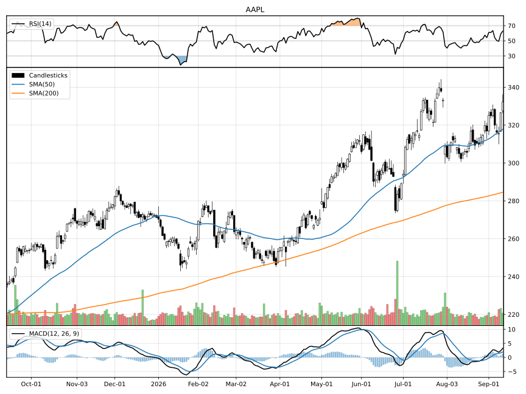

# Home

Create classic technical analysis stock charts in Python with minimal code. The library is built around [matplotlib](https://matplotlib.org/) and supports both [pandas](https://pandas.pydata.org/) and [polars](https://pola.rs/) DataFrames. Charts are defined with a declarative interface, based on a set of drawing primitives like `Candlesticks`, `Volume` and technical indicators like `SMA`, `EMA`, `RSI`, `ROC`, `MACD`, etc.




## Installation

```bash
pip install mplchart
```

## Typical Usage

```python
# Candlesticks chart with SMA, RSI and MACD indicators

import yfinance as yf

from mplchart.chart import Chart
from mplchart.primitives import Candlesticks, Volume, Pane, LinePlot
from mplchart.indicators import SMA, RSI, MACD

ticker = 'AAPL'
prices = yf.Ticker(ticker).history('5y')

Chart(prices, title=ticker, max_bars=250, normalize=True).plot(
    Candlesticks(), Volume(), SMA(50), SMA(200),
    Pane("above", yticks=(30, 50, 70)),
    LinePlot(RSI(14), overbought=70, oversold=30),
    Pane("below"),
    MACD(),
).show()
```

## Conventions

Prices data is expected to be a dataframe with columns `open`, `high`, `low`, `close`, `volume` in **lower case** and a datetime column named `date` or `datetime` (or a datetime index for pandas). If your data has column names in different capitalization (like data from yfinance) use the `normalize` option `Chart(..., normalize=True)` or call `normalize_prices` explicitly to normalize the dataframe.

